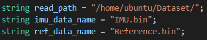
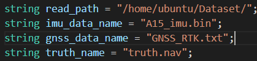
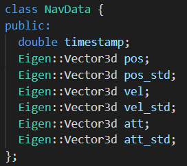
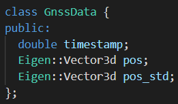
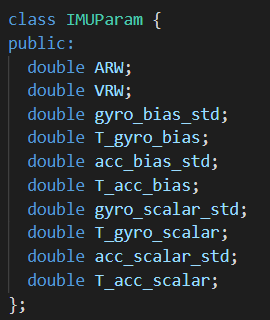
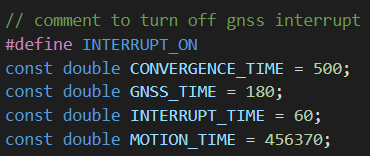

# INS

## 机械编排代码使用说明：

1. INSMechanization类的测试文件mechanization_test.cpp需要修改数据的路径和文件名才能运行。

2. 数据需要按照DataStorage.hpp和mechanization_test.cpp中的对应格式来存放。

## 松组合代码使用说明：

1. GINS类的测试文件GINS_test.cpp需要修改数据的路径和文件名才能运行。

2. 数据需要按照DataStorage.hpp和GINS_test.cpp中的对应格式来存放。

3. 可以在GINS_test.cpp中根据需要选择是否开启GNSS信号中断调试，支持调整初始收敛时间、GNSS信号持续时间、GNSS信号中断配置时间和开始运动时间。

​		运行结束后会输出nav文件。

4. 可以在GINS.cpp中根据需要选择不同的针对GNSS信号时间戳和IMU信号时间戳不重合的内插方法。

